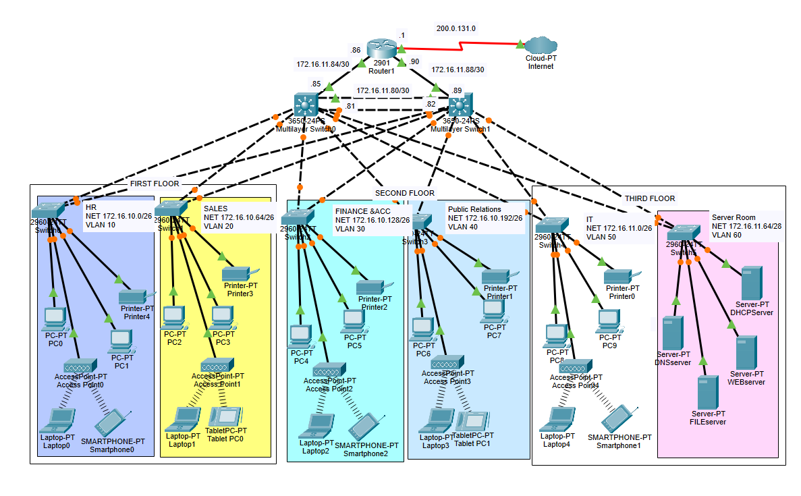

# Enterprise Network Security Design

## Overview
This project demonstrates a secure enterprise network designed using Cisco Packet Tracer.

## Network Features
- VLAN segmentation per department
- Inter-VLAN routing using multilayer switches
- Dedicated server room VLAN
- Wired and wireless users
- Internet connectivity
  

## VLAN Design
| VLAN | Department | Network |
|-----|------------|---------|
| 10 | HR | 172.16.10.0/26 |
| 20 | Sales | 172.16.10.64/26 |
| 30 | Finance & Accounting | 172.16.10.128/26 |
| 40 | Public Relations | 172.16.10.192/26 |
| 50 | IT | 172.16.11.0/26 |
| 60 | Server Room | 172.16.11.64/28 |

## Servers configuration 
The server room VLAN hosts multiple enterprise services:
- DHCP Server
  - Dynamically assigns IP addresses to network devices
- DNS Server
  - Resolves domain names to IP addresses, Configured domains for:
    - Company website
    - File server
    - DNS server
- FTP Server
  - Secure file access using username and password authentication
- Web Server
  - Hosts and manages the company’s internal website

## Routing protocols
- OSPF enabled on:
  -Router LAN-facing interfaces
  -Distribution multilayer switches
- Static default route configured on the Internet-facing router interfac

## Link Aggregation (EtherChannel)
- Implemented EtherChannel between distribution multilayer switches
- Increased bandwidth and provided link redundancy
- Used trunk links to carry multiple VLANs

## Network Address Translation (PAT)
- Implemented Port Address Translation (PAT) to allow internal private networks to access the Internet
- Used a pool of public IP address for outbound traffic

## NAT Security (ACL)
- Applied ACL to control which internal VLANs are allowed to use PAT
- Restricted Internet access to authorized internal networks only

## Security Controls
### Port Security
- Enabled on all access switch ports
- Sticky MAC addresses learning
- Maximum 1 MAC per port
- Violation mode: shutdown

### Access Control Lists (ACLs)
- Server room access restricted using ACLs
- Only authorized VLANs can access servers

### Switch Hardening
- All unused switch ports are administratively shut down

## Network Topology

#This project is intended for educational and portfolio purposes, demonstrating enterprise networking and security concepts using Cisco technologies

